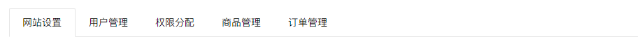
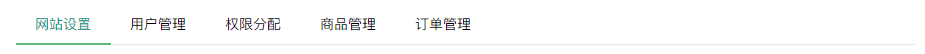
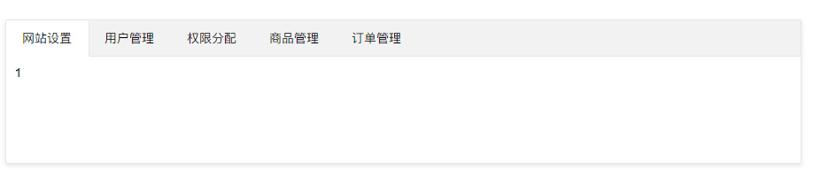
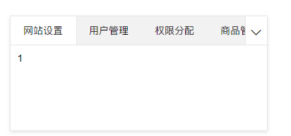
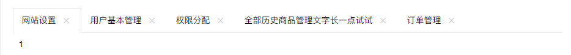

# Tab选项卡 - 页面元素

>   导航菜单可应用于头部和侧边，Tab选项卡提供多套风格，支持响应式，支持删除选项卡等功能。面包屑结构简单，支持自定义分隔符。

>   依赖加载组件：[element](https://www.layui.com/doc/modules/element.html) （请注意：必须加载element模块，相关功能才能正常使用，详见：内置组件 - 常用元素操作）


## 默认Tab选项卡

Tab广泛应用于Web页面，因此我们也对其进行了良好的支持。Layui内置多种Tab风格，支持删除选项卡、并提供响应式支持。 
这是一个最基本的例子：



>   如果需要对Tab进行外部新增、删除、切换等操作，请移步到“内置组件-常用元素操作”页面中查阅：基础方法

```
<div class="layui-tab">
  <ul class="layui-tab-title">
    <li class="layui-this">网站设置</li>
    <li>用户管理</li>
    <li>权限分配</li>
    <li>商品管理</li>
    <li>订单管理</li>
  </ul>
  <div class="layui-tab-content">
    <div class="layui-tab-item layui-show">内容1</div>
    <div class="layui-tab-item">内容2</div>
    <div class="layui-tab-item">内容3</div>
    <div class="layui-tab-item">内容4</div>
    <div class="layui-tab-item">内容5</div>
  </div>
</div>
 
<script>
//注意：选项卡 依赖 element 模块，否则无法进行功能性操作
layui.use('element', function(){
  var element = layui.element;
  
  //…
});
</script>
```

## Tab简洁风格



```
<div class="layui-tab layui-tab-brief" lay-filter="docDemoTabBrief">
  <ul class="layui-tab-title">
    <li class="layui-this">网站设置</li>
    <li>用户管理</li>
    <li>权限分配</li>
    <li>商品管理</li>
    <li>订单管理</li>
  </ul>
  <div class="layui-tab-content"></div>
</div>   
```

通过追加class：*layui-tab-brief* 来设定简洁风格。
值得注意的是，如果存在 *layui-tab-item* 的内容区域，在切换时自动定位到对应内容。如果不存在内容区域，则不会定位到对应内容。你通常需要设置过滤器，通过 *element*模块的监听tab事件来进行切换操作。详见文档左侧【内置组件 - 基本元素操作 element】

## Tab卡片风格



```
<div class="layui-tab layui-tab-card">
  <ul class="layui-tab-title">
    <li class="layui-this">网站设置</li>
    <li>用户管理</li>
    <li>权限分配</li>
    <li>商品管理</li>
    <li>订单管理</li>
  </ul>
  <div class="layui-tab-content" style="height: 100px;">
    <div class="layui-tab-item layui-show">1</div>
    <div class="layui-tab-item">2</div>
    <div class="layui-tab-item">3</div>
    <div class="layui-tab-item">4</div>
    <div class="layui-tab-item">5</div>
    <div class="layui-tab-item">6</div>
  </div>
</div>
```

通过追加class：*layui-tab-card*来设定卡片风格

## Tab响应式

当容器的宽度不足以显示全部的选项时，即会自动出现展开图标，如下以卡片风格为例（注意：所有Tab风格都支持响应式）：



额，感觉像是打了个小酱油。而事实上在自适应的页面中（不固宽），它的意义才会呈现。

带删除的Tab

你可以对父层容器设置属性 *lay-allowClose="true"* 来允许Tab选项卡被删除



```
<div class="layui-tab" lay-allowClose="true">
  <ul class="layui-tab-title">
    <li class="layui-this">网站设置</li>
    <li>用户基本管理</li>
    <li>权限分配</li>
    <li>全部历史商品管理文字长一点试试</li>
    <li>订单管理</li>
  </ul>
  <div class="layui-tab-content">
    <div class="layui-tab-item layui-show">1</div>
    <div class="layui-tab-item">2</div>
    <div class="layui-tab-item">3</div>
    <div class="layui-tab-item">4</div>
    <div class="layui-tab-item">5</div>
    <div class="layui-tab-item">6</div>
  </div>
</div>
```

与默认相比没有什么特别的结构，就是多了个属性 *lay-allowClose="true"*

## ID焦点定位

你可以通过对选项卡设置属性 *lay-id="xxx"* 来作为唯一的匹配索引，以用于外部的定位切换，如后台的左侧导航、以及页面地址 hash的匹配。

```
<div class="layui-tab" lay-filter="test1">
  <ul class="layui-tab-title">
    <li class="layui-this" lay-id="111" >文章列表</li>
    <li lay-id="222">发送信息</li>
    <li lay-id="333">权限分配</li>
    <li lay-id="444">审核</li>
    <li lay-id="555">订单管理</li>
  </ul>
  <div class="layui-tab-content">
    <div class="layui-tab-item layui-show">1</div>
    <div class="layui-tab-item">2</div>
    <div class="layui-tab-item">3</div>
    <div class="layui-tab-item">4</div>
    <div class="layui-tab-item">5</div>
  </div>
</div>
```

属性 lay-id 是扮演这项功能的主要角色，它是动态操作的重要凭据，如：

```
<script>
layui.use('element', function(){
  var element = layui.element;
  
  //获取hash来切换选项卡，假设当前地址的hash为lay-id对应的值
  var layid = location.hash.replace(/^#test1=/, '');
  element.tabChange('test1', layid); //假设当前地址为：http://a.com#test1=222，那么选项卡会自动切换到“发送消息”这一项
  
  //监听Tab切换，以改变地址hash值
  element.on('tab(test1)', function(){
    location.hash = 'test1='+ this.getAttribute('lay-id');
  });
});
</script>  
```

同样的还有增加选项卡和删除选项卡，都需要用到 lay-id，更多动态操作请阅读：[element模块](https://www.layui.com/doc/modules/element.html)