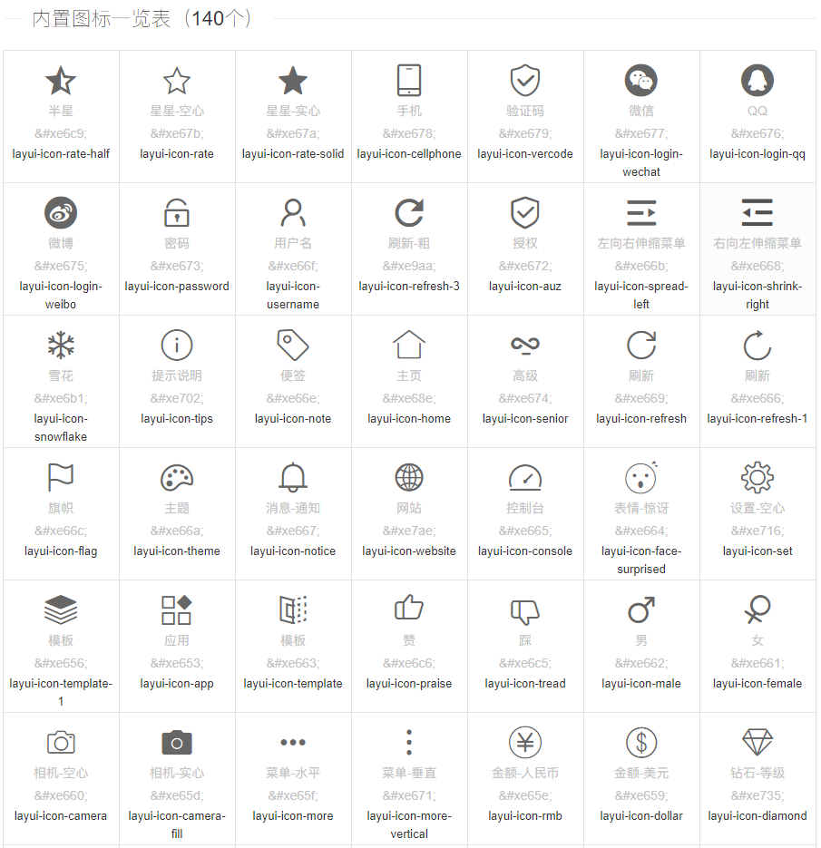
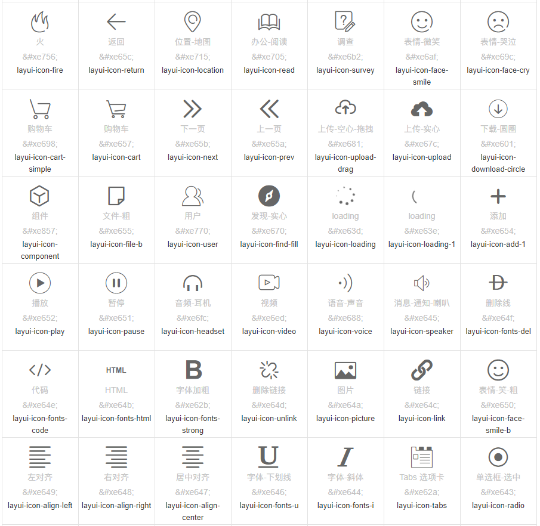
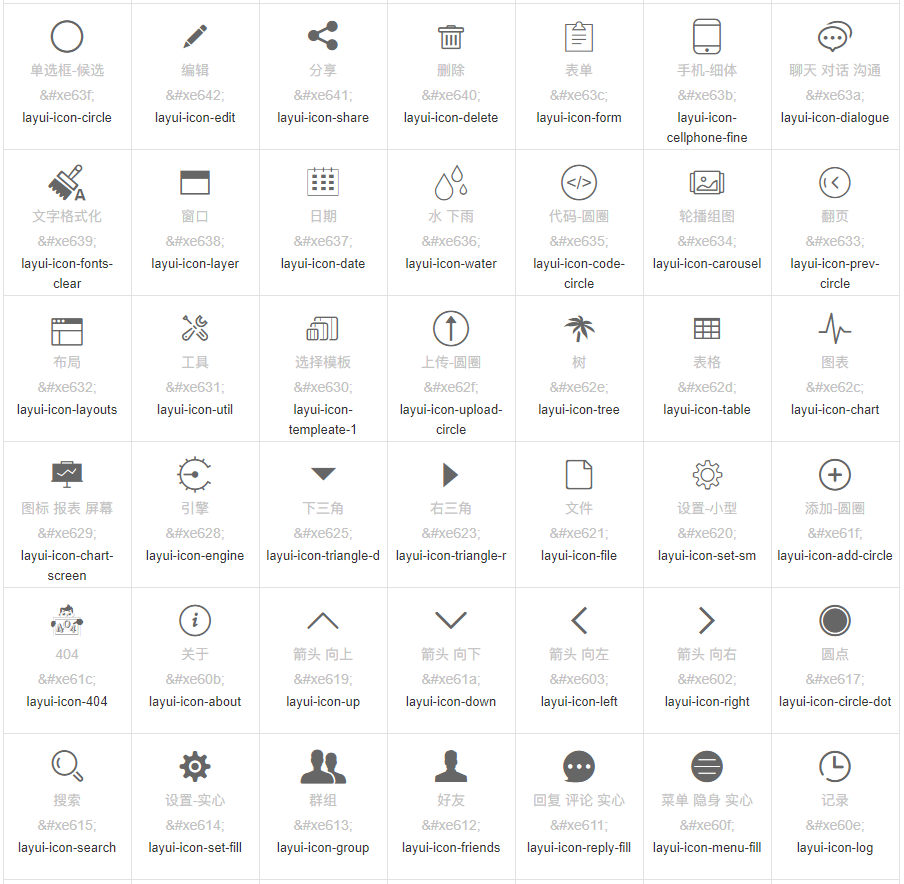
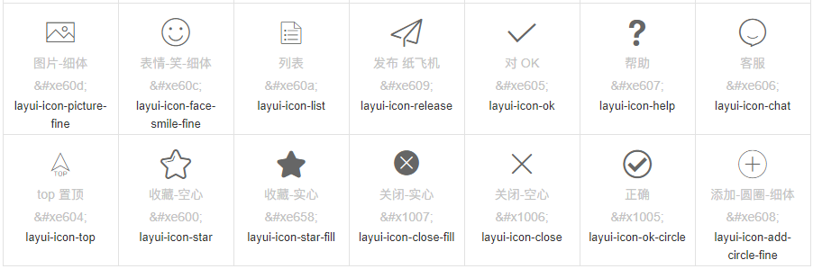

# 字体图标

>   layui 的所有图标全部采用字体形式，取材于阿里巴巴矢量图标库（iconfont）。因此你可以把一个 icon 看作是一个普通的文字，这意味着你直接用 css 控制文字属性，如 color、font-size，就可以改变图标的颜色和大小。你可以通过 *font-class* 或 *unicode* 来定义不同的图标。
>

使用方式

通过对一个内联元素（一般推荐用 *i*标签）设定 *class="layui-icon"*，来定义一个图标，然后对元素加上图标对应的 *font-class*（注意：layui 2.3.0 之前只支持采用 *unicode 字符*)，即可显示出你想要的图标，譬如：

```
从 layui 2.3.0 开始，支持 font-class 的形式定义图标：
<i class="layui-icon layui-icon-face-smile"></i>   
      
    codelayui.code
    注意：在 layui 2.3.0 之前的版本，只能设置 unicode 来定义图标
    <i class="layui-icon">&#xe60c;</i>   
    其中的 &#xe60c; 即是图标对应的 unicode 字符
    
你可以去定义它的颜色或者大小，如：  
<i class="layui-icon layui-icon-face-smile" style="font-size: 30px; color: #1E9FFF;"></i>  
```







