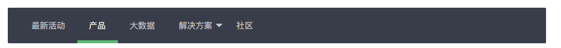
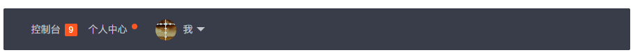
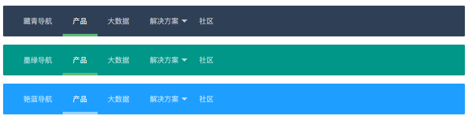
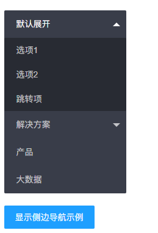

# 导航相关 - 页面元素

>   导航一般指页面引导性频道集合，多以菜单的形式呈现，可应用于头部和侧边，是整个网页画龙点晴般的存在。面包屑结构简单，支持自定义分隔符。千万不要忘了加载 *element*模块。虽然大部分行为都是在加载完该模块后自动完成的，但一些交互操作，如呼出二级菜单等，需借助element模块才能使用。你可以移步文档左侧【内置模块 - 常用元素操作 element】了解详情

>   依赖加载模块：[element](https://www.layui.com/doc/modules/element.html)


## 水平导航



-   

```
<ul class="layui-nav" lay-filter="">
  <li class="layui-nav-item"><a href="">最新活动</a></li>
  <li class="layui-nav-item layui-this"><a href="">产品</a></li>
  <li class="layui-nav-item"><a href="">大数据</a></li>
  <li class="layui-nav-item">
    <a href="javascript:;">解决方案</a>
    <dl class="layui-nav-child"> <!-- 二级菜单 -->
      <dd><a href="">移动模块</a></dd>
      <dd><a href="">后台模版</a></dd>
      <dd><a href="">电商平台</a></dd>
    </dl>
  </li>
  <li class="layui-nav-item"><a href="">社区</a></li>
</ul>
 
<script>
//注意：导航 依赖 element 模块，否则无法进行功能性操作
layui.use('element', function(){
  var element = layui.element;
  
  //…
});
</script>
```

设定*layui-this*来指向当前页面分类。

## 导航中的其它元素

------

除了一般的文字导航，我们还内置了图片和徽章的支持，如：



-   

```
<ul class="layui-nav">
  <li class="layui-nav-item">
    <a href="">控制台<span class="layui-badge">9</span></a>
  </li>
  <li class="layui-nav-item">
    <a href="">个人中心<span class="layui-badge-dot"></span></a>
  </li>
  <li class="layui-nav-item">
    <a href="">我</a>
    <dl class="layui-nav-child">
      <dd><a href="javascript:;">修改信息</a></dd>
      <dd><a href="javascript:;">安全管理</a></dd>
      <dd><a href="javascript:;">退了</a></dd>
    </dl>
  </li>
</ul>
```

是否瞬间上了个档次呢？

## 导航主题



通过对导航追加CSS背景类，让导航呈现不同的主题色

```
//如定义一个墨绿背景色的导航
<ul class="layui-nav layui-bg-green" lay-filter="">
  …
</ul> 
```

水平导航支持的其它背景主题有：*layui-bg-cyan*（藏青）、*layui-bg-molv*（墨绿）、*layui-bg-blue*（艳蓝） 
垂直导航支持的其它背景主题有：*layui-bg-cyan*（藏青）

## 垂直/侧边导航



```
<ul class="layui-nav layui-nav-tree" lay-filter="test">
<!-- 侧边导航: <ul class="layui-nav layui-nav-tree layui-nav-side"> -->
  <li class="layui-nav-item layui-nav-itemed">
    <a href="javascript:;">默认展开</a>
    <dl class="layui-nav-child">
      <dd><a href="javascript:;">选项1</a></dd>
      <dd><a href="javascript:;">选项2</a></dd>
      <dd><a href="">跳转</a></dd>
    </dl>
  </li>
  <li class="layui-nav-item">
    <a href="javascript:;">解决方案</a>
    <dl class="layui-nav-child">
      <dd><a href="">移动模块</a></dd>
      <dd><a href="">后台模版</a></dd>
      <dd><a href="">电商平台</a></dd>
    </dl>
  </li>
  <li class="layui-nav-item"><a href="">产品</a></li>
  <li class="layui-nav-item"><a href="">大数据</a></li>
</ul>
```

水平、垂直、侧边三个导航的HTML结构是完全一样的，不同的是：

>   垂直导航需要追加class：*layui-nav-tree* 
>   侧边导航需要追加class：*layui-nav-tree layui-nav-side*

导航可选属性

对导航元素结构设定可选属性，可让导航菜单项达到不同效果。目前支持的属性如下：

| 属性名       | 可选值                                                       | 说明                                                         |
| :----------- | :----------------------------------------------------------- | :----------------------------------------------------------- |
| lay-shrink   | *空值*（默认） 不收缩兄弟菜单子菜单*all* 收缩全部兄弟菜单子菜单 | 展开子菜单时，是否收缩兄弟节点已展开的子菜单 （注：layui 2.2.6 开始新增）  如：*<ul class="layui-nav layui-nav-tree" lay-shrink="all"> … </ul>* |
| lay-unselect | 无需填值                                                     | 点击指定导航菜单时，不会出现选中效果（注：layui 2.2.0 开始新增）  如：*<li class="layui-nav-item" lay-unselect>刷新</li>* |

## 面包屑

[首页](https://www.layui.com/doc/element/nav.html)/ [国际新闻](https://www.layui.com/doc/element/nav.html)/ [亚太地区](https://www.layui.com/doc/element/nav.html)/ 正文

```
<span class="layui-breadcrumb">
  <a href="">首页</a>
  <a href="">国际新闻</a>
  <a href="">亚太地区</a>
  <a><cite>正文</cite></a>
</span>
```

你还可以通过设置属性 *lay-separator="-"* 来自定义分隔符。如： [首页](https://www.layui.com/doc/element/nav.html)- [国际新闻](https://www.layui.com/doc/element/nav.html)- [亚太地区](https://www.layui.com/doc/element/nav.html)- 正文

```
<span class="layui-breadcrumb" lay-separator="-">
  <a href="">首页</a>
  <a href="">国际新闻</a>
  <a href="">亚太地区</a>
  <a><cite>正文</cite></a>
</span>
```

当然，你还可以作为小导航来用，如：

[娱乐](https://www.layui.com/doc/element/nav.html)| [八卦](https://www.layui.com/doc/element/nav.html)| [体育](https://www.layui.com/doc/element/nav.html)| [搞笑](https://www.layui.com/doc/element/nav.html)| [视频](https://www.layui.com/doc/element/nav.html)| [游戏](https://www.layui.com/doc/element/nav.html)| [综艺](https://www.layui.com/doc/element/nav.html)

```
<span class="layui-breadcrumb" lay-separator="|">
  <a href="">娱乐</a>
  <a href="">八卦</a>
  <a href="">体育</a>
  <a href="">搞笑</a>
  <a href="">视频</a>
  <a href="">游戏</a>
  <a href="">综艺</a>
</span>
```