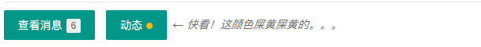
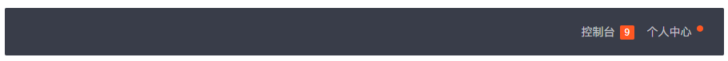
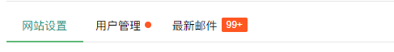

# 徽章

>   徽章是一个修饰性的元素，它们本身细小而并不显眼，但掺杂在其它元素中就显得尤为突出了。页面往往因徽章的陪衬，而显得十分和谐。


## 快速使用

不妨先来看看 徽章 这个小小的大家族吧：

>   

你可能已经敏锐地发现，除去花枝招展的七种颜色，徽章具有三种不同的风格类型：*小圆点*、*椭圆体*、*边框体*

```
小圆点，通过 layui-badge-dot 来定义，里面不能加文字
<span class="layui-badge-dot"></span>
<span class="layui-badge-dot layui-bg-orange"></span>
<span class="layui-badge-dot layui-bg-green"></span>
<span class="layui-badge-dot layui-bg-cyan"></span>
<span class="layui-badge-dot layui-bg-blue"></span>
<span class="layui-badge-dot layui-bg-black"></span>
<span class="layui-badge-dot layui-bg-gray"></span>
 
椭圆体，通过 layui-badge 来定义。事实上我们把这个视作为主要使用方式
<span class="layui-badge">6</span>
<span class="layui-badge">99</span>
<span class="layui-badge">61728</span>
 
<span class="layui-badge">赤</span>
<span class="layui-badge layui-bg-orange">橙</span>
<span class="layui-badge layui-bg-green">绿</span>
<span class="layui-badge layui-bg-cyan">青</span>
<span class="layui-badge layui-bg-blue">蓝</span>
<span class="layui-badge layui-bg-black">黑</span>
<span class="layui-badge layui-bg-gray">灰</span>
 
边框体，通过 layui-badge-rim 来定义
<span class="layui-badge-rim">6</span>
<span class="layui-badge-rim">Hot</span>
```

## 与其它元素的搭配

徽章主要是修饰作用，因此必不可少要与几乎所有的元素搭配。我们目前对以下元素内置了徽章的排版支持：

**按钮**

------



```
<button class="layui-btn">查看消息<span class="layui-badge layui-bg-gray">1</span></button>
<button class="layui-btn">动态<span class="layui-badge-dot layui-bg-orange"></span></button>
```

**导航**

------



-   

```
<ul class="layui-nav" style="text-align: right;"> <-- 小Tips：这里有没有发现，设置导航靠右对齐（或居中对齐）其实非常简单 -->
  <li class="layui-nav-item">
    <a href="">控制台<span class="layui-badge">9</span></a>
  </li>
  <li class="layui-nav-item">
    <a href="">个人中心<span class="layui-badge-dot"></span></a>
  </li>
</ul>
```

**选项卡**（所有风格都支持，这里以简约风格为例）



```
<div class="layui-tab layui-tab-brief">
  <ul class="layui-tab-title">
    <li class="layui-this">网站设置</li>
    <li>用户管理<span class="layui-badge-dot"></span></li>
    <li>最新邮件<span class="layui-badge">99+</span></li>
  </ul>
  <div class="layui-tab-content"></div>
</div>
```