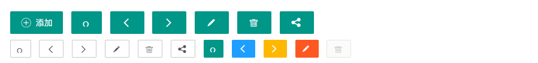

# 按钮 - 页面元素

>   向任意HTML元素设定*class="layui-btn"*，建立一个基础按钮。通过追加格式为*layui-btn-{type}*的class来定义其它按钮风格。内置的按钮class可以进行任意组合，从而形成更多种按钮风格。

## 用法

```
codelayui.code<button class="layui-btn">一个标准的按钮</button><a href="http://www.layui.com" class="layui-btn">一个可跳转的按钮</a>      
```

## 主题


| 名称 | 组合                                 |
| ---- | ------------------------------------ |
| 原始 | class="layui-btn layui-btn-primary"  |
| 默认 | class="layui-btn"                    |
| 百搭 | class="layui-btn layui-btn-normal"   |
| 暖色 | class="layui-btn layui-btn-warm"     |
| 警告 | class="layui-btn layui-btn-danger"   |
| 禁用 | class="layui-btn layui-btn-disabled" |

## 尺寸


| 尺寸 | 组合                           |
| ---- | ------------------------------ |
| 大型 | class="layui-btn layui-btn-lg" |
| 默认 | class="layui-btn"              |
| 小型 | class="layui-btn layui-btn-sm" |
| 迷你 | class="layui-btn layui-btn-xs" |


| 尺寸     | 组合                                              |
| -------- | ------------------------------------------------- |
| 大型百搭 | class="layui-btn layui-btn-lg layui-btn-normal"   |
| 正常暖色 | class="layui-btn layui-btn-warm"                  |
| 小型警告 | class="layui-btn layui-btn-sm layui-btn-danger"   |
| 迷你禁用 | class="layui-btn layui-btn-xs layui-btn-disabled" |


```
codelayui.code      <button class="layui-btn layui-btn-fluid">流体按钮（最大化适应）</button>      
```

## 圆角


| 主题 | 组合                                                  |
| ---- | ----------------------------------------------------- |
| 原始 | class="layui-btn layui-btn-radius layui-btn-primary"  |
| 默认 | class="layui-btn layui-btn-radius"                    |
| 百搭 | class="layui-btn layui-btn-radius layui-btn-normal"   |
| 暖色 | class="layui-btn layui-btn-radius layui-btn-warm"     |
| 警告 | class="layui-btn layui-btn-radius layui-btn-danger"   |
| 禁用 | class="layui-btn layui-btn-radius layui-btn-disabled" |


| 尺寸     | 组合                                                         |
| -------- | ------------------------------------------------------------ |
| 大型百搭 | class="layui-btn layui-btn-lg layui-btn-radius layui-btn-normal" |
| 小型警告 | class="layui-btn layui-btn-sm layui-btn-radius layui-btn-danger" |
| 迷你禁用 | class="layui-btn layui-btn-xs layui-btn-radius layui-btn-disabled" |

## 图标



```
<button class="layui-btn">
  <i class="layui-icon">&#xe608;</i> 添加
</button>
 
<button class="layui-btn layui-btn-sm layui-btn-primary">
  <i class="layui-icon">&#x1002;</i>
</button>
```

温馨提示：各种图标字体请移步文档左侧【页面元素 - 图标】阅览

## 按钮组

增加 编辑 删除


将按钮放入一个*class="layui-btn-group"*元素中，即可形成按钮组，按钮本身仍然可以随意搭配

```
<div class="layui-btn-group">
  <button class="layui-btn">增加</button>
  <button class="layui-btn">编辑</button>
  <button class="layui-btn">删除</button>
</div>
      
<div class="layui-btn-group">
  <button class="layui-btn layui-btn-sm">
    <i class="layui-icon">&#xe654;</i>
  </button>
  <button class="layui-btn layui-btn-sm">
    <i class="layui-icon">&#xe642;</i>
  </button>
  <button class="layui-btn layui-btn-sm">
    <i class="layui-icon">&#xe640;</i>
  </button>
  <button class="layui-btn layui-btn-sm">
    <i class="layui-icon">&#xe602;</i>
  </button>
</div>
 
<div class="layui-btn-group">
  <button class="layui-btn layui-btn-primary layui-btn-sm">
    <i class="layui-icon">&#xe654;</i>
  </button>
  <button class="layui-btn layui-btn-primary layui-btn-sm">
    <i class="layui-icon">&#xe642;</i>
  </button>
  <button class="layui-btn layui-btn-primary layui-btn-sm">
    <i class="layui-icon">&#xe640;</i>
  </button>
</div>
```

## 按钮容器

尽管按钮在同节点并排时会自动拉开间距，但在按钮太多的情况，效果并不是很美好。因为你需要用到按钮容器


```
<div class="layui-btn-container">
  <button class="layui-btn">按钮一</button> 
  <button class="layui-btn">按钮二</button> 
  <button class="layui-btn">按钮三</button> 
</div>
```