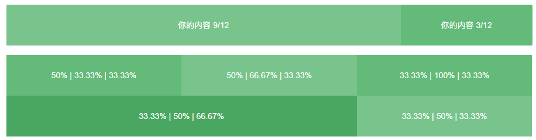
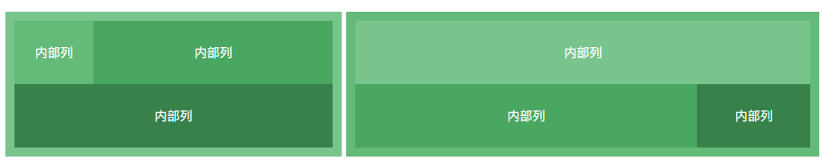

# 栅格系统与后台布局

>   如你所愿，在 layui 2.0 的版本中，我们加入了强劲的栅格系统和后台布局方案，这意味着你终于可以着手采用 layui 排版你的响应式网站和后台系统了。layui 的栅格系统采用业界比较常见的 12 等分规则，内置移动设备、平板、桌面中等和大型屏幕的多终端适配处理，最低能支持到ie8。而你应当更欣喜的是，layui 终于开放了它经典的后台布局方案，快速搭建一个属于你的后台系统将变得十分轻松自如。

## 栅格系统

为了丰富网页布局，简化 HTML/CSS 代码的耦合，并提升多终端的适配能力，layui 在 2.0 的版本中引进了自己的一套具备响应式能力的栅格系统。我们将容器进行了 12 等分，预设了 4*12 种 CSS 排列类，它们在移动设备、平板、桌面中/大尺寸四种不同的屏幕下发挥着各自的作用。

### 一、栅格布局规则：

------

| 1.   | 采用 *layui-row* 来定义行，如：*<div class="layui-row"></div>* |
| ---- | ------------------------------------------------------------ |
| 2.   | 采用类似 *layui-col-md** 这样的预设类来定义一组列（column），且放在行（row）内。其中：变量*md* 代表的是不同屏幕下的标记（可选值见下文）变量*** 代表的是该列所占用的12等分数（如6/12），可选值为 1 - 12如果多个列的“等分数值”总和等于12，则刚好满行排列。如果大于12，多余的列将自动另起一行。 |
| 3.   | 列可以同时出现最多四种不同的组合，分别是：*xs*（超小屏幕，如手机）、*sm*（小屏幕，如平板）、*md*（桌面中等屏幕）、*lg*（桌面大型屏幕），以呈现更加动态灵活的布局。 |
| 4.   | 可对列追加类似 *layui-col-space5*、 *layui-col-md-offset3* 这样的预设类来定义列的间距和偏移。 |
| 5.   | 最后，在列（column）元素中放入你自己的任意元素填充内容，完成布局！ |

示例（这里只是大致列举两个，更多实例请前往 [示例-栅格](https://www.layui.com/demo/grid.html) 查看）



```
<div class="layui-container">  
  常规布局（以中型屏幕桌面为例）：
  <div class="layui-row">
    <div class="layui-col-md9">
      你的内容 9/12
    </div>
    <div class="layui-col-md3">
      你的内容 3/12
    </div>
  </div>
   
  移动设备、平板、桌面端的不同表现：
  <div class="layui-row">
    <div class="layui-col-xs6 layui-col-sm6 layui-col-md4">
      移动：6/12 | 平板：6/12 | 桌面：4/12
    </div>
    <div class="layui-col-xs6 layui-col-sm6 layui-col-md4">
      移动：6/12 | 平板：6/12 | 桌面：4/12
    </div>
    <div class="layui-col-xs4 layui-col-sm12 layui-col-md4">
      移动：4/12 | 平板：12/12 | 桌面：4/12
    </div>
    <div class="layui-col-xs4 layui-col-sm7 layui-col-md8">
      移动：4/12 | 平板：7/12 | 桌面：8/12
    </div>
    <div class="layui-col-xs4 layui-col-sm5 layui-col-md4">
      移动：4/12 | 平板：5/12 | 桌面：4/12
    </div>
  </div>
</div>
```

### 二、响应式规则：

------

栅格的响应式能力，得益于CSS3媒体查询（Media Queries）的强力支持，从而针对四类不同尺寸的屏幕，进行相应的适配处理

|                             | 超小屏幕 (手机<768px)    | 小屏幕 (平板≥768px)                                    | 中等屏幕 (桌面≥992px) | 大型屏幕 (桌面≥1200px) |
| :-------------------------- | :----------------------- | :----------------------------------------------------- | :-------------------- | :--------------------- |
| *.layui-container*的值      | auto                     | 750px                                                  | 970px                 | 1170px                 |
| 标记                        | xs                       | sm                                                     | md                    | lg                     |
| 列对应类 * 为1-12的等分数值 | layui-col-xs*            | layui-col-sm*                                          | layui-col-md*         | layui-col-lg*          |
| 总列数                      | 12                       |                                                        |                       |                        |
| 响应行为                    | 始终按设定的比例水平排列 | 在当前屏幕下水平排列，如果屏幕大小低于临界值则堆叠排列 |                       |                        |

### 三、响应式公共类：

------

| 类名（class）             | 说明                                                        |
| :------------------------ | :---------------------------------------------------------- |
| layui-show-*-block        | 定义不同设备下的 display: block; * 可选值有：xs、sm、md、lg |
| layui-show-*-inline       | 定义不同设备下的 display: inline; * 可选值同上              |
| layui-show-*-inline-block | 定义不同设备下的 display: inline-block; * 可选值同上        |
| layui-hide-*              | 定义不同设备下的隐藏类，即： display: none; * 可选值同上    |

### 四、布局容器：

------

将栅格放入一个带有 *class="layui-container"* 的特定的容器中，以便在小屏幕以上的设备中固定宽度，让列可控。

```
<div class="layui-container">
  <div class="layui-row">
    ……
  </div>
</div>  
```

​       当然，你还可以不固定容器宽度。将栅格或其它元素放入一个带有 *class="layui-fluid"* 的容器中，那么宽度将不会固定，而是 100% 适应

```
<div class="layui-fluid">
  ……
</div>   
```

 五、列间距：

通过“列间距”的预设类，来设定列之间的间距。且一行中最左的列不会出现左边距，最右的列不会出现右边距。列间距在保证排版美观的同时，还可以进一步保证分列的宽度精细程度。我们结合网页常用的边距，预设了 12 种不同尺寸的边距，分别是：

------

| 列间样式          | 列间距          |
| ----------------- | --------------- |
| layui-col-space1  | 列之间间隔 1px  |
| layui-col-space3  | 列之间间隔 3px  |
| layui-col-space5  | 列之间间隔 5px  |
| layui-col-space8  | 列之间间隔 8px  |
| layui-col-space10 | 列之间间隔 10px |
| layui-col-space12 | 列之间间隔 12px |
| layui-col-space15 | 列之间间隔 15px |
| layui-col-space18 | 列之间间隔 18px |
| layui-col-space20 | 列之间间隔 20px |
| layui-col-space22 | 列之间间隔 22px |
| layui-col-space28 | 列之间间隔 28px |
| layui-col-space30 | 列之间间隔 30px |

下面是一个简单的例子，列间距为10px：


```
<div class="layui-row layui-col-space10">
  <div class="layui-col-md4">
    1/3
  </div>
  <div class="layui-col-md4">
    1/3
  </div>
  <div class="layui-col-md4">
    1/3
  </div>
</div>
```

如果需要的间距高于30px（一般不常见），请采用偏移，下文继续讲解

### 六、列偏移：

------

对列追加 类似 *layui-col-md-offset** 的预设类，从而让列向右偏移。其中 *** 号代表的是偏移占据的列数，可选中为 1 - 12。 
如：*layui-col-md-offset3*，即代表在“中型桌面屏幕”下，让该列向右偏移3个列宽度

下面是一个采用“列偏移”机制让两个列左右对齐的实例


```
<div class="layui-row">
  <div class="layui-col-md4">
    4/12
  </div>
  <div class="layui-col-md4 layui-col-md-offset4">
    偏移4列，从而在最右
  </div>
</div>
```

请注意，列偏移可针对不同屏幕的标准进行设定，比如上述的例子，只会在桌面屏幕下有效，当低于桌面屏幕的规定的临界值，就会堆叠排列。

### 七、栅格嵌套：

------

理论上，你可以对栅格进行无穷层次的嵌套，这更加增强了栅格的表现能力。而嵌套的使用非常简单。在列元素（*layui-col-md**）中插入一个行元素（*layui-row*），即可完成嵌套。下面是一个简单的例子：



```
<div class="layui-row layui-col-space5">
  <div class="layui-col-md5">
    <div class="layui-row grid-demo">
      <div class="layui-col-md3">
        内部列
      </div>
      <div class="layui-col-md9">
        内部列
      </div>
      <div class="layui-col-md12">
        内部列
      </div>
    </div>
  </div>
  <div class="layui-col-md7">
    <div class="layui-row grid-demo grid-demo-bg1">
      <div class="layui-col-md12">
        内部列
      </div>
      <div class="layui-col-md9">
        内部列
      </div>
      <div class="layui-col-md3">
        内部列
      </div>
    </div>
  </div>
</div>
```

### 八、让IE8/9兼容栅格：

------

事实上IE8和IE9并不支持媒体查询（Media Queries），但你可以使用下面的补丁完美兼容！该补丁来自于开源社区：

```
<!-- 让IE8/9支持媒体查询，从而兼容栅格 -->
<!--[if lt IE 9]>
  <script src="https://cdn.staticfile.org/html5shiv/r29/html5.min.js"></script>
  <script src="https://cdn.staticfile.org/respond.js/1.4.2/respond.min.js"></script>
<![endif]-->
```

将上述代码放入你页面 *<body>* 标签内的任意位置

后台布局

layui 之所以赢得如此多人的青睐，更多是在于它前后台系统通吃的能力。既可编织出绚丽的前台页面，又可满足繁杂的后台功能需求。layui 致力于让每一位开发者都能轻松搭建自己的后台。下面是 layui 提供的一个现场的方案，你可以前往示例页面，[预览后台布局效果](https://www.layui.com/demo/layuiAdmin.html)

```
<!DOCTYPE html>
<html>
<head>
  <meta charset="utf-8">
  <meta name="viewport" content="width=device-width, initial-scale=1, maximum-scale=1">
  <title>layout 后台大布局 - Layui</title>
  <link rel="stylesheet" href="../src/css/layui.css">
</head>
<body class="layui-layout-body">
<div class="layui-layout layui-layout-admin">
  <div class="layui-header">
    <div class="layui-logo">layui 后台布局</div>
    <!-- 头部区域（可配合layui已有的水平导航） -->
    <ul class="layui-nav layui-layout-left">
      <li class="layui-nav-item"><a href="">控制台</a></li>
      <li class="layui-nav-item"><a href="">商品管理</a></li>
      <li class="layui-nav-item"><a href="">用户</a></li>
      <li class="layui-nav-item">
        <a href="javascript:;">其它系统</a>
        <dl class="layui-nav-child">
          <dd><a href="">邮件管理</a></dd>
          <dd><a href="">消息管理</a></dd>
          <dd><a href="">授权管理</a></dd>
        </dl>
      </li>
    </ul>
    <ul class="layui-nav layui-layout-right">
      <li class="layui-nav-item">
        <a href="javascript:;">
          
          贤心
        </a>
        <dl class="layui-nav-child">
          <dd><a href="">基本资料</a></dd>
          <dd><a href="">安全设置</a></dd>
        </dl>
      </li>
      <li class="layui-nav-item"><a href="">退了</a></li>
    </ul>
  </div>
  
  <div class="layui-side layui-bg-black">
    <div class="layui-side-scroll">
      <!-- 左侧导航区域（可配合layui已有的垂直导航） -->
      <ul class="layui-nav layui-nav-tree"  lay-filter="test">
        <li class="layui-nav-item layui-nav-itemed">
          <a class="" href="javascript:;">所有商品</a>
          <dl class="layui-nav-child">
            <dd><a href="javascript:;">列表一</a></dd>
            <dd><a href="javascript:;">列表二</a></dd>
            <dd><a href="javascript:;">列表三</a></dd>
            <dd><a href="">超链接</a></dd>
          </dl>
        </li>
        <li class="layui-nav-item">
          <a href="javascript:;">解决方案</a>
          <dl class="layui-nav-child">
            <dd><a href="javascript:;">列表一</a></dd>
            <dd><a href="javascript:;">列表二</a></dd>
            <dd><a href="">超链接</a></dd>
          </dl>
        </li>
        <li class="layui-nav-item"><a href="">云市场</a></li>
        <li class="layui-nav-item"><a href="">发布商品</a></li>
      </ul>
    </div>
  </div>
  
  <div class="layui-body">
    <!-- 内容主体区域 -->
    <div style="padding: 15px;">内容主体区域</div>
  </div>
  
  <div class="layui-footer">
    <!-- 底部固定区域 -->
    © layui.com - 底部固定区域
  </div>
</div>
<script src="../src/layui.js"></script>
<script>
//JavaScript代码区域
layui.use('element', function(){
  var element = layui.element;
  
});
</script>
</body>
</html>
```