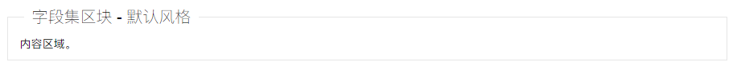
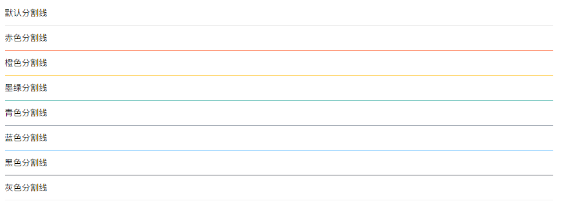

# 简单辅助元素 - 页面元素

>   本篇主要集中罗列页面中的一些简单辅助元素，如：引用块、字段集区块、横线等等，这些元素都无需依赖任何模块


引用区块

>   引用区域的文字

>   引用区域的文字

目前内置了上述两种风格

```
<blockquote class="layui-elem-quote">引用区域的文字</blockquote>
<blockquote class="layui-elem-quote layui-quote-nm">引用区域的文字</blockquote>      
```

## 字段集区块

### 字段集区块 - 默认风格



 同样内置了两种风格，另一种风格即该文档的标题横线：字段集一行

```
<fieldset class="layui-elem-field">
  <legend>字段集区块 - 默认风格</legend>
  <div class="layui-field-box">
    内容区域
  </div>
</fieldset>
 
<fieldset class="layui-elem-field layui-field-title">
  <legend>字段集区块 - 横线风格</legend>
  <div class="layui-field-box">
    内容区域
  </div>
</fieldset>
你可以把它看作是一个有标题的横线
```

### 横线



```
默认分割线
<hr>
 
赤色分割线
<hr class="layui-bg-red">
 
橙色分割线
<hr class="layui-bg-orange">
 
墨绿分割线
<hr class="layui-bg-green">
 
青色分割线
<hr class="layui-bg-cyan">
 
蓝色分割线
<hr class="layui-bg-blue">
 
黑色分割线
<hr class="layui-bg-black">
 
灰色分割线
<hr class="layui-bg-gray">
```