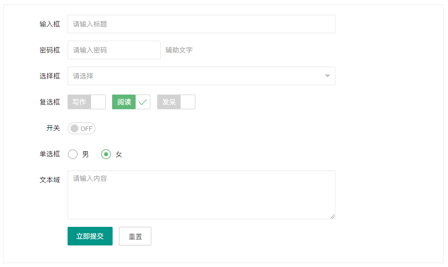
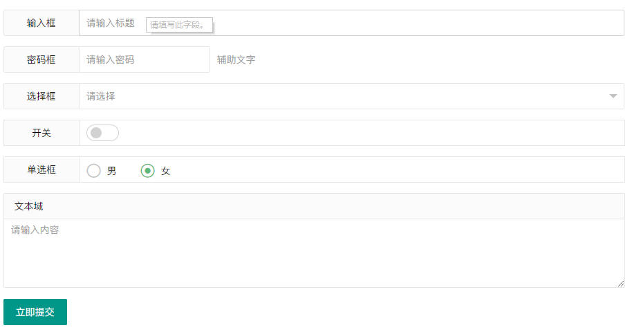

# 表单 - 页面元素

>   在一个容器中设定 *class="layui-form"* 来标识一个表单元素块，通过规范好的HTML结构及CSS类，来组装成各式各样的表单元素，并通过内置的 *form模块* 来完成各种交互。

>   依赖加载模块：[form](https://www.layui.com/doc/modules/form.html) （请注意：如果不加载form模块，select、checkbox、radio等将无法显示，并且无法使用form相关功能）


## 小睹为快



>   通过上述的小小演示，你已经大致了解了一波 layui 的表单模块，你可能会觉得她还算不错，但并不太过瘾？譬如你希望看到日期选择、图片上传等等。然而你必须认识到，本篇文档核心介绍的是表单元素，对于日期、上传等更多丰富的元素，其实也是可以很方便地穿插在内的。

下述是【小睹为快】的HTML结构：

```
<form class="layui-form" action="">
  <div class="layui-form-item">
    <label class="layui-form-label">输入框</label>
    <div class="layui-input-block">
      <input type="text" name="title" required  lay-verify="required" placeholder="请输入标题" autocomplete="off" class="layui-input">
    </div>
  </div>
  <div class="layui-form-item">
    <label class="layui-form-label">密码框</label>
    <div class="layui-input-inline">
      <input type="password" name="password" required lay-verify="required" placeholder="请输入密码" autocomplete="off" class="layui-input">
    </div>
    <div class="layui-form-mid layui-word-aux">辅助文字</div>
  </div>
  <div class="layui-form-item">
    <label class="layui-form-label">选择框</label>
    <div class="layui-input-block">
      <select name="city" lay-verify="required">
        <option value=""></option>
        <option value="0">北京</option>
        <option value="1">上海</option>
        <option value="2">广州</option>
        <option value="3">深圳</option>
        <option value="4">杭州</option>
      </select>
    </div>
  </div>
  <div class="layui-form-item">
    <label class="layui-form-label">复选框</label>
    <div class="layui-input-block">
      <input type="checkbox" name="like[write]" title="写作">
      <input type="checkbox" name="like[read]" title="阅读" checked>
      <input type="checkbox" name="like[dai]" title="发呆">
    </div>
  </div>
  <div class="layui-form-item">
    <label class="layui-form-label">开关</label>
    <div class="layui-input-block">
      <input type="checkbox" name="switch" lay-skin="switch">
    </div>
  </div>
  <div class="layui-form-item">
    <label class="layui-form-label">单选框</label>
    <div class="layui-input-block">
      <input type="radio" name="sex" value="男" title="男">
      <input type="radio" name="sex" value="女" title="女" checked>
    </div>
  </div>
  <div class="layui-form-item layui-form-text">
    <label class="layui-form-label">文本域</label>
    <div class="layui-input-block">
      <textarea name="desc" placeholder="请输入内容" class="layui-textarea"></textarea>
    </div>
  </div>
  <div class="layui-form-item">
    <div class="layui-input-block">
      <button class="layui-btn" lay-submit lay-filter="formDemo">立即提交</button>
      <button type="reset" class="layui-btn layui-btn-primary">重置</button>
    </div>
  </div>
</form>
 
<script>
//Demo
layui.use('form', function(){
  var form = layui.form;
  
  //监听提交
  form.on('submit(formDemo)', function(data){
    layer.msg(JSON.stringify(data.field));
    return false;
  });
});
</script>
```

UI的最终呈现得益于 Form模块 的全自动渲染，她将原本普通的诸如select、checkbox、radio等元素重置为你所看到的模样。或许你可以移步左侧导航的 *内置模块* 中的 *表单* 对其进行详细的了解。

>   而本篇介绍的是表单元素本身，譬如规定的区块、CSS类、原始控件等。他们共同组成了一个表单体系。

下述是基本的行区块结构，它提供了响应式的支持。但如果你不大喜欢，你可以换成你的结构，但必须要在外层容器中定义*class="layui-form"*，form模块才能正常工作。

```
<div class="layui-form-item">
  <label class="layui-form-label">标签区域</label>
  <div class="layui-input-block">
    原始表单元素区域
  </div>
</div>
```

## 输入框


```
<input type="text" name="title" required lay-verify="required" placeholder="请输入标题" autocomplete="off" class="layui-input">  
```

>   *required*：注册浏览器所规定的必填字段 
>   *lay-verify*：注册form模块需要验证的类型 
>   *class="layui-input"*：layui.css提供的通用CSS类 

这些在下文都不再做重复介绍

## 下拉选择框


```
<select name="city" lay-verify="">
  <option value="">请选择一个城市</option>
  <option value="010">北京</option>
  <option value="021">上海</option>
  <option value="0571">杭州</option>
</select>     
```

上述option的第一项主要是占个坑，让form模块预留“请选择”的提示空间，否则将会把第一项（存在value值）作为默认选中项。你可以在option的空值项中自定义文本，如：请选择分类。

你可以通过设定 *selected* 来设定默认选中项：

```
<select name="city" lay-verify="">
  <option value="010">北京</option>
  <option value="021" disabled>上海（禁用效果）</option>
  <option value="0571" selected>杭州</option>
</select>  
```

你还可以通过 *optgroup* 标签给select分组：

```
<select name="quiz">
  <option value="">请选择</option>
  <optgroup label="城市记忆">
    <option value="你工作的第一个城市">你工作的第一个城市？</option>
  </optgroup>
  <optgroup label="学生时代">
    <option value="你的工号">你的工号？</option>
    <option value="你最喜欢的老师">你最喜欢的老师？</option>
  </optgroup>
</select>
```

以及通过设定属性 *lay-search* 来开启搜索匹配功能

```
<select name="city" lay-verify="" lay-search>
  <option value="010">layer</option>
  <option value="021">form</option>
  <option value="0571" selected>layim</option>
  ……
</select> 
```

>   属性*selected*可设定默认项 
>   属性*disabled*开启禁用，select和option标签都支持

## 复选框


```
默认风格：
<input type="checkbox" name="" title="写作" checked>
<input type="checkbox" name="" title="发呆"> 
<input type="checkbox" name="" title="禁用" disabled> 
 
原始风格：
<input type="checkbox" name="" title="写作" lay-skin="primary" checked>
<input type="checkbox" name="" title="发呆" lay-skin="primary"> 
<input type="checkbox" name="" title="禁用" lay-skin="primary" disabled> 
```

属性*title*可自定义文本（温馨提示：如果只想显示复选框，可以不用设置title） 
属性*checked*可设定默认选中 
属性*lay-skin*可设置复选框的风格 
设置*value="1"*可自定义值，否则选中时返回的就是默认的on

## 开关


其实就是checkbox复选框的“变种”，通过设定 *lay-skin="switch"* 形成了开关风格

```
<input type="checkbox" name="xxx" lay-skin="switch">
<input type="checkbox" name="yyy" lay-skin="switch" lay-text="ON|OFF" checked>
<input type="checkbox" name="zzz" lay-skin="switch" lay-text="开启|关闭">
<input type="checkbox" name="aaa" lay-skin="switch" disabled>
```

属性*checked*可设定默认开 
属性*disabled*开启禁用 
属性*lay-text*可自定义开关两种状态的文本 
设置*value="1"*可自定义值，否则选中时返回的就是默认的on

## 单选框


```
<input type="radio" name="sex" value="nan" title="男">
<input type="radio" name="sex" value="nv" title="女" checked>
<input type="radio" name="sex" value="" title="中性" disabled>
```

属性*title*可自定义文本 
属性*disabled*开启禁用 
设置*value="xxx"*可自定义值，否则选中时返回的就是默认的on

## 文本域


```
<textarea name="" required lay-verify="required" placeholder="请输入" class="layui-textarea"></textarea>
```

*class="layui-textarea"*：layui.css提供的通用CSS类 

## 组装行内表单


```
<div class="layui-form-item">
 
  <div class="layui-inline">
    <label class="layui-form-label">范围</label>
    <div class="layui-input-inline" style="width: 100px;">
      <input type="text" name="price_min" placeholder="￥" autocomplete="off" class="layui-input">
    </div>
    <div class="layui-form-mid">-</div>
    <div class="layui-input-inline" style="width: 100px;">
      <input type="text" name="price_max" placeholder="￥" autocomplete="off" class="layui-input">
    </div>
  </div>
  
  <div class="layui-inline">
    <label class="layui-form-label">密码</label>
    <div class="layui-input-inline" style="width: 100px;">
      <input type="password" name="" autocomplete="off" class="layui-input">
    </div>
  </div>
  
</div>
```

>   *class="layui-inline"*：定义外层行内 
>   *class="layui-input-inline"*：定义内层行内

## 忽略美化渲染

你可以对表单元素增加属性 *lay-ignore* 设置后，将不会对该标签进行美化渲染，即保留系统风格，比如：


```
codelayui.code<select lay-ignore>  <option>…</option></select>      
```

一般不推荐这样做。事实上form组件所提供的接口，对其渲染过的元素，足以应付几乎所有的业务需求。如果忽略渲染，可能会让UI风格不和谐

## 表单方框风格



通过追加 *layui-form-pane* 的class，来设定表单的方框风格。内部结构不变。我们的Fly社区用的就是这个风格。

```
<form class="layui-form layui-form-pane" action="">
  内部结构都一样，值得注意的是 复选框/开关/单选框 这些组合在该风格下需要额外添加 pane属性（否则会看起来比较别扭），如：
  <div class="layui-form-item" pane>
    <label class="layui-form-label">单选框</label>
    <div class="layui-input-block">
      <input type="radio" name="sex" value="男" title="男">
      <input type="radio" name="sex" value="女" title="女" checked>
    </div>
  </div>
</form>
```