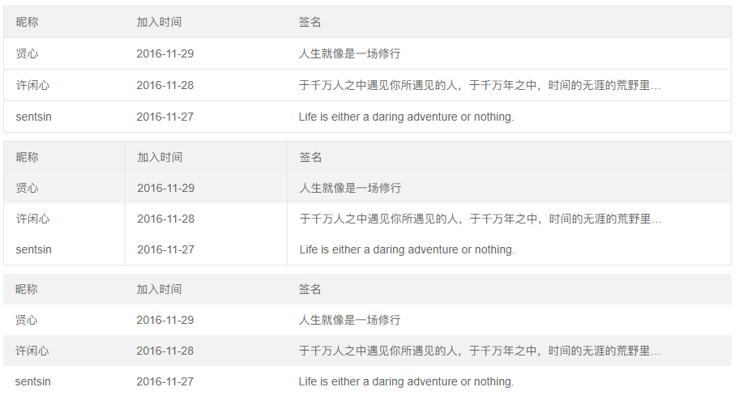
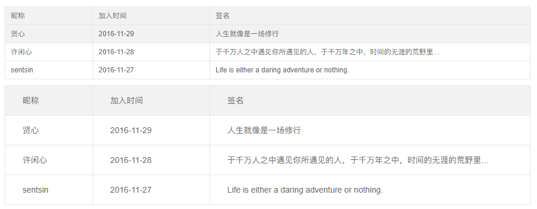

# 表格 - 页面元素

>   本篇为你介绍表格的HTML使用，你将通过内置的自定义属性对其进行风格的多样化设定。*请注意：*这仅仅局限于呈现基础表格，如果你急切需要的是数据表格（*datatable*），那么你应该详细阅读：[table模块](https://www.layui.com/doc/modules/table.html)

## 常规用法


```
<table class="layui-table">
  <colgroup>
    <col width="150">
    <col width="200">
    <col>
  </colgroup>
  <thead>
    <tr>
      <th>昵称</th>
      <th>加入时间</th>
      <th>签名</th>
    </tr> 
  </thead>
  <tbody>
    <tr>
      <td>贤心</td>
      <td>2016-11-29</td>
      <td>人生就像是一场修行</td>
    </tr>
    <tr>
      <td>许闲心</td>
      <td>2016-11-28</td>
      <td>于千万人之中遇见你所遇见的人，于千万年之中，时间的无涯的荒野里…</td>
    </tr>
  </tbody>
</table>
```

## 基础属性

静态表格支持以下基础属性，可定义不同风格/尺寸的表格样式：


将你所需要的基础属性写在table标签上即可，如（一个带有隔行背景，且行边框风格的大尺寸表格）：

```
<table lay-even lay-skin="line" lay-size="lg">
…
</table>
```

## 表格其它风格

除了默认的表格风格外，我们还提供了其它几种风格，你可以按照实际需求自由设定



```
<table class="layui-table" lay-skin="line">
  行边框表格（内部结构参见右侧目录“常规用法”）
</table>
 
<table class="layui-table" lay-skin="row">
  列边框表格（内部结构参见右侧目录“常规用法”）
</table>
 
<table class="layui-table" lay-even lay-skin="nob">
  无边框表格（内部结构参见右侧目录“常规用法”）
</table>
```

表格其它尺寸

除了默认的表格尺寸外，我们还提供了其它几种尺寸，你可以按照实际需求自由设定



```
<table class="layui-table" lay-size="sm">
  小尺寸表格（内部结构参见右侧目录“常规用法”）
</table>
 
<table class="layui-table" lay-size="lg">
  大尺寸表格（内部结构参见右侧目录“常规用法”）
</table>
```