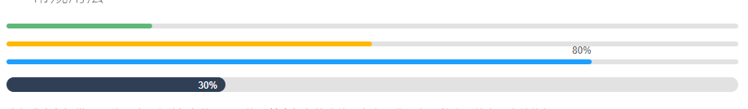
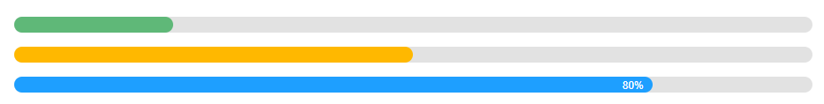

# 进度条 - 页面元素

>   进度条可应用于许多业务场景，如任务完成进度、loading等等，是一种较为直观的表达元素。

>   依赖加载组件：[element](https://www.layui.com/doc/modules/element.html)


## 常规用法



我们进度条提供了两种尺寸及多种颜色的显示风格，其中颜色的选值可参考：[背景色公共类](https://www.layui.com/doc/base/element.html#css)。基本元素结构如下

```
<div class="layui-progress">
  <div class="layui-progress-bar" lay-percent="10%"></div>
</div>
 
<script>
//注意进度条依赖 element 模块，否则无法进行正常渲染和功能性操作
layui.use('element', function(){
  var element = layui.element;
});
</script>
```

属性 *lay-percent* ：代表进度条的初始百分比，你也可以动态改变进度，详见：[进度条的动态操作](https://www.layui.com/doc/modules/element.html#progress)

正如上述你见到的，当对元素设置了class为 *layui-progress-big* 时，即为大尺寸的进度条风格。默认风格的进度条的百分比如果开启，会在右上角显示，而大号进度条则会在内部显示。

## 显示进度比文本


通过对父级元素设置属性 *lay-showPercent="yes"* 来开启进度比的文本显示，支持：*普通数字*、*百分数*、*分数*（layui 2.1.7 新增）

```
<div class="layui-progress" lay-showPercent="true">
  <div class="layui-progress-bar layui-bg-red" lay-percent="1/3"></div>
</div>
       
<div class="layui-progress" lay-showPercent="yes">
  <div class="layui-progress-bar layui-bg-red" lay-percent="30%"></div>
</div>
 
<div class="layui-progress layui-progress-big" lay-showPercent="yes">
  <div class="layui-progress-bar layui-bg-green" lay-percent="50%"></div>
</div>
```

注意：默认情况下不会显示百分比文本，如果你想开启，对属性lay-showPercent设置任意值即可，如：yes。但如果不想显示，千万别设置no或者false，直接剔除该属性即可。

## 大号进度条



如果短小细长的它不大适合追求激情与视觉冲击的你，那么你完全可以选择大而粗，尽情地销魂于活塞运动。研究表明：上述尺寸刚刚好。

```
<div class="layui-progress layui-progress-big">
  <div class="layui-progress-bar" lay-percent="20%"></div>
</div>
 
<div class="layui-progress layui-progress-big">
  <div class="layui-progress-bar layui-bg-orange" lay-percent="50%"></div>
</div>
 
<div class="layui-progress layui-progress-big" lay-showPercent="true">
  <div class="layui-progress-bar layui-bg-blue" lay-percent="80%"></div>
</div>
```

正如上述你见到的，当对元素设置了class为 layui-progress-big 时，即为大尺寸的进度条风格。默认风格的进度条的百分比如果开启，会在右上角显示，而大号进度条则会在内部显示。

如果你需要对进度条进行动态操作，如动态改变进度，那么你需要阅读：[element模块](https://www.layui.com/doc/modules/element.html)