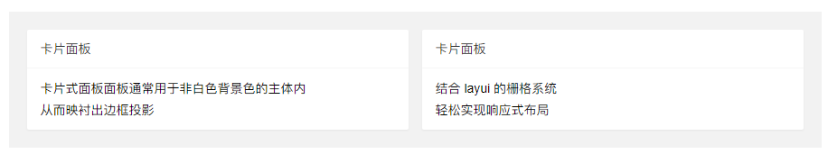
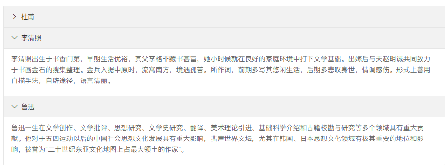
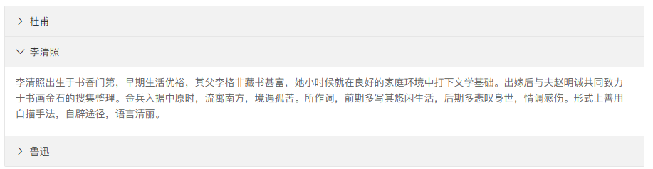

# 面板 - 页面元素

>   一般的面板通常是指一个独立的容器，而折叠面板则能有效地节省页面的可视面积，非常适合应用于：QA说明、帮助文档等

>   依赖加载组件：[element](https://www.layui.com/doc/modules/element.html)



```
<div class="layui-card">
  <div class="layui-card-header">卡片面板</div>
  <div class="layui-card-body">
    卡片式面板面板通常用于非白色背景色的主体内<br>
    从而映衬出边框投影
  </div>
</div>
```

## 折叠面板



通过对内容元素设置class为 *layui-show* 来选择性初始展开某一个面板，element 模块会自动呈现状态图标。

```
<div class="layui-collapse">
  <div class="layui-colla-item">
    <h2 class="layui-colla-title">杜甫</h2>
    <div class="layui-colla-content layui-show">内容区域</div>
  </div>
  <div class="layui-colla-item">
    <h2 class="layui-colla-title">李清照</h2>
    <div class="layui-colla-content layui-show">内容区域</div>
  </div>
  <div class="layui-colla-item">
    <h2 class="layui-colla-title">鲁迅</h2>
    <div class="layui-colla-content layui-show">内容区域</div>
  </div>
</div>
 
<script>
//注意：折叠面板 依赖 element 模块，否则无法进行功能性操作
layui.use('element', function(){
  var element = layui.element;
  
  //…
});
</script>
```

## 开启手风琴

## 

在折叠面板的父容器设置属性 *lay-accordion* 来开启手风琴，那么在进行折叠操作时，始终只会展现当前的面板。

```
<div class="layui-collapse" lay-accordion>
  <div class="layui-colla-item">
    <h2 class="layui-colla-title">杜甫</h2>
    <div class="layui-colla-content layui-show">内容区域</div>
  </div>
  <div class="layui-colla-item">
    <h2 class="layui-colla-title">李清照</h2>
    <div class="layui-colla-content layui-show">内容区域</div>
  </div>
  <div class="layui-colla-item">
    <h2 class="layui-colla-title">鲁迅</h2>
    <div class="layui-colla-content layui-show">内容区域</div>
  </div>
</div>
```